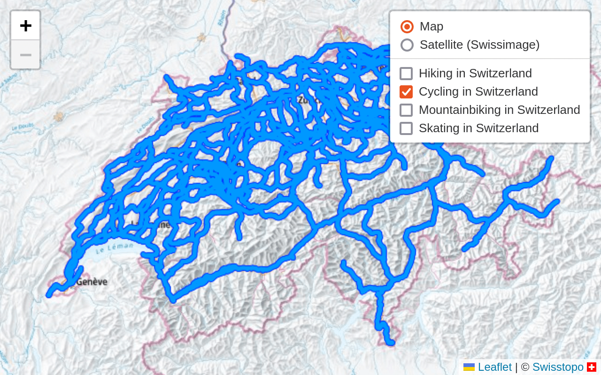

<h1 class="d-flex flex-justify-between">
  Leaflet.TileLayer.Swiss
  <iframe
    src="https://ghbtns.com/github-btn.html?user=rkaravia&repo=Leaflet.TileLayer.Swiss&type=star&count=true&size=large"
    frameborder="0"
    scrolling="0"
    width="120"
    height="30"
    title="GitHub"
  ></iframe>
</h1>

::: {.example-wrapper .mb-1}

<iframe src="examples/quick-start.html"></iframe>
:::

[Open example in new tab](quick-start.html){.d-flex .flex-justify-center .mb-3}

[Leaflet.TileLayer.Swiss](https://github.com/rkaravia/Leaflet.TileLayer.Swiss)
is a [Leaflet](https://leafletjs.com/) plugin for displaying national
maps of Switzerland using map tiles from
[Swisstopo](https://www.swisstopo.ch/). This plugin is not affiliated
with or endorsed by Swisstopo.

## Quick start

The following code explains all steps required to get started with
Leaflet.TileLayer.Swiss. It corresponds to the example at the top of the
page. In order to run it locally, copy the 2 files below into a folder
on your computer, then [run a local web
server](https://developer.mozilla.org/en-US/docs/Learn/Common_questions/set_up_a_local_testing_server#Running_a_simple_local_HTTP_server)
from that folder and open it in your browser.

### quick-start.html

```html{examples/quick-start.html}
<!-- This will be replaced by content of quick-start.html -->
```

### quick-start.js

```javascript{examples/quick-start.js}
// This will be replaced by content of quick-start.js
```

## Advanced usage

A
[leaflet-tilelayer-swiss](https://www.npmjs.com/package/leaflet-tilelayer-swiss)
npm package is available as well.

The [README on
GitHub](https://github.com/rkaravia/Leaflet.TileLayer.Swiss) contains
more information, including full API documentation.

The [multiple layers example](examples/multiple-layers.html) demonstrates
advanced usage of the plugin.

::: {.example-wrapper}
[](examples/multiple-layers.html)
:::

## License

© Roman Karavia, [MIT license](https://github.com/rkaravia/Leaflet.TileLayer.Swiss/blob/main/LICENSE)
